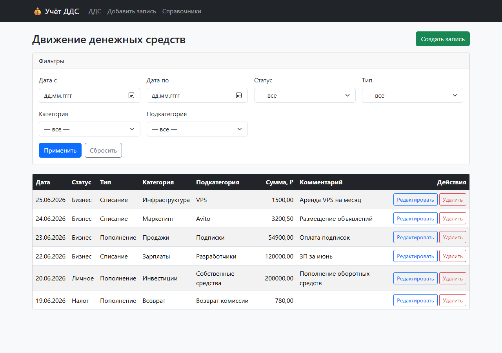
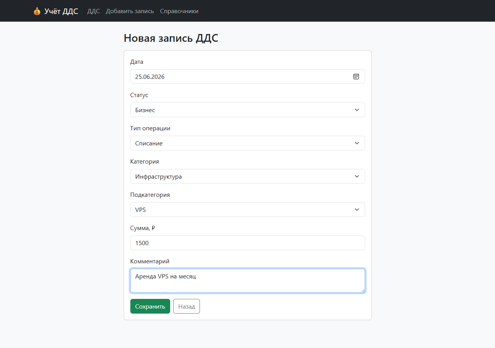
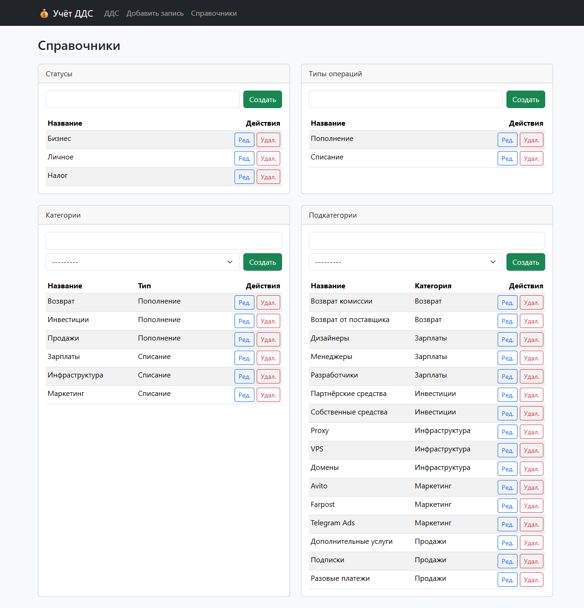

<div align="center">

# 💰 Cashflow Service

### Веб-сервис учёта движения денежных средств (ДДС)

Учёт поступлений и списаний с категориями, справочниками и строгими
логическими зависимостями между сущностями.


</div>

---

## 📌 О проекте

Пользователь ведёт записи о доходах и расходах. Каждая запись связана со
**статусом**, **типом операции**, **категорией** и **подкатегорией**. Система
не даёт выбрать категорию, не относящуюся к типу, или подкатегорию, не
относящуюся к категории — целостность данных гарантируется на трёх уровнях:
**клиент → форма/сериализатор → база данных**.

Проект демонстрирует чистую структуру Django-приложения, корректную работу с
ORM, продуманную валидацию бизнес-правил и аккуратный REST API на DRF.

## ✨ Возможности

| Блок | Что реализовано |
|------|-----------------|
| **Записи ДДС** | Создание, просмотр, редактирование, удаление с подтверждением |
| **Фильтры** | Период дат, статус, тип, категория, подкатегория — через GET, комбинируются, значения сохраняются |
| **Справочники** | CRUD статусов, типов, категорий и подкатегорий на одной странице |
| **Зависимые select** | Категории фильтруются по типу, подкатегории — по категории (AJAX + ванильный JS) |
| **Валидация** | Клиентская (HTML5) + серверная (формы и DRF-сериализаторы) |
| **Целостность** | `on_delete=PROTECT` — справочник нельзя удалить, если он используется в записях (без silent cascade) |
| **REST API** | `ModelViewSet` для всех сущностей с теми же проверками зависимостей |
| **Admin** | Все модели зарегистрированы, `list_display` / `list_filter` |
| **Данные** | Команда `seed_data` для справочников и примеров записей |
| **Тесты** | 17 unit-тестов: формы, представления, фильтры, AJAX, API |

## 🧠 Логические зависимости (ядро задания)

```
OperationType (Пополнение / Списание)
      └── Category (Маркетинг, Инфраструктура, ...)
              └── Subcategory (Avito, VPS, ...)
                      └── CashFlowRecord
```

Правила, проверяемые **и на клиенте, и на сервере**:

- `category.operation_type == record.operation_type`
- `subcategory.category == record.category`
- `amount > 0`
- обязательны: сумма, тип, категория, подкатегория

На клиенте при выборе типа подгружаются только подходящие категории, при выборе
категории — только подходящие подкатегории, поэтому собрать неверную связку в
UI невозможно. На сервере та же проверка дублируется в `CashFlowRecordForm.clean()`
и в `CashFlowRecordSerializer.validate()` — даже «сырой» POST с неверной связкой
вернёт ошибку формы / `400`.

## 🛠 Стек

- **Python 3.11+**, **Django 5.2**, **Django REST Framework 3.x**
- **SQLite** (по умолчанию, без внешних зависимостей)
- **Django Templates + Bootstrap 5** (CDN)
- **Ванильный JavaScript** — только для зависимых select-полей

## 🚀 Быстрый старт

```bash
# 1. Клонировать и зайти в каталог
git clone https://github.com/egordushenko/cashflow-service
cd Django_web

# 2. Виртуальное окружение
python -m venv .venv
source .venv/bin/activate          # Linux / macOS
# .venv\Scripts\activate           # Windows (PowerShell / CMD)

# 3. Зависимости
pip install -r requirements.txt

# 4. База данных + тестовые данные
python manage.py migrate
python manage.py seed_data

# 5. Запуск
python manage.py runserver
```

Откройте **http://127.0.0.1:8000/**

> `seed_data` создаёт статусы, типы, полное дерево категорий/подкатегорий из ТЗ
> и несколько примеров записей, чтобы главная страница не была пустой. Команда
> идемпотентна для справочников.

Опционально — доступ к админке:

```bash
python manage.py createsuperuser   # затем http://127.0.0.1:8000/admin/
```

## ✅ Тесты

```bash
python manage.py test
```

```
Ran 17 tests in 0.07s
OK
```

Покрытие: валидная запись, запрет `amount <= 0`, запрет неверной связки
тип/категория и категория/подкатегория, обязательные поля, главная страница,
фильтр по типу, AJAX-эндпоинты, ответ API и отклонение неверных связок через API.

## 🗺 Страницы

| URL | Назначение |
|-----|------------|
| `/` | Список записей ДДС + фильтры |
| `/records/create/` | Создание записи |
| `/records/<id>/edit/` | Редактирование |
| `/records/<id>/delete/` | Подтверждение удаления |
| `/references/` | Справочники (4 блока на одной странице) |
| `/admin/` | Django admin |

**AJAX:** `GET /ajax/categories/?operation_type=<id>` · `GET /ajax/subcategories/?category=<id>`

## 🔌 REST API (DRF)

Корень: **`/api/`** (доступен браузерный DRF-интерфейс).

| Endpoint | Сущность |
|----------|----------|
| `/api/statuses/` | Status |
| `/api/types/` | OperationType |
| `/api/categories/` | Category — фильтр `?operation_type=<id>` |
| `/api/subcategories/` | Subcategory — фильтр `?category=<id>` |
| `/api/records/` | CashFlowRecord (валидация связок и `amount > 0`) |

## 🧱 Структура проекта

```
cashflow_service/        # настройки, корневой urls.py (admin + api + web)
cashflow/
├── models.py            # Status, OperationType, Category, Subcategory, CashFlowRecord
├── forms.py             # ModelForm + бизнес-валидация в clean()
├── views.py             # web-вьюхи + AJAX endpoints
├── urls.py              # маршруты приложения
├── serializers.py       # DRF-сериализаторы
├── api.py               # DRF ModelViewSet-ы
├── admin.py             # регистрация моделей
├── tests.py             # 17 unit-тестов
├── management/commands/
│   └── seed_data.py     # начальное заполнение
├── templates/cashflow/  # Bootstrap-шаблоны
└── static/cashflow/js/  # dependent_selects.js
```

## 📸 Скриншоты

### Список записей с фильтрами


### Форма записи с зависимыми select (Списание → Инфраструктура → VPS)


### Управление справочниками

